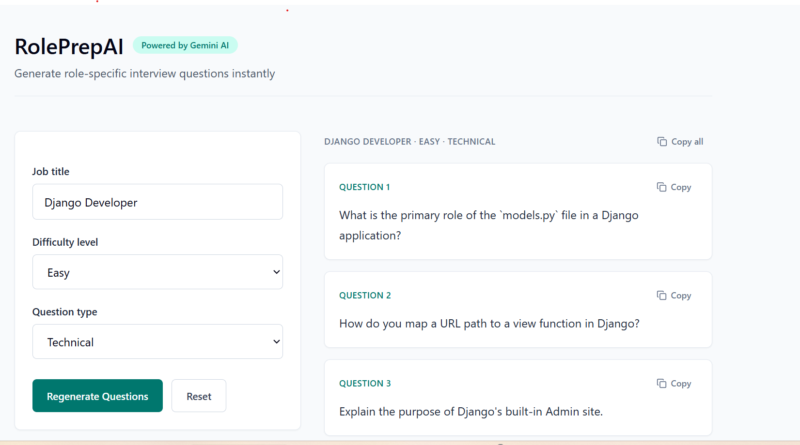

# RolePrepAI

**AI-powered interview preparation platform using Django and Google Gemini API**

**Live:** [https://roleprepai.solomonferede.com.et](https://roleprepai.solomonferede.com.et)  
**Repository:** [github.com/solomonferede/roleprep-ai](https://github.com/solomonferede/roleprep-ai)

---

## Features

- 🤖 **AI-Powered Questions** - Generates role-specific interview questions using Google Gemini API
- 🔄 **Key Rotation** - Automatically cycles through multiple API keys when rate limits are hit
- 🚀 **Production Ready** - Fully containerized with Docker and Docker Compose
- 🔒 **Secure** - SSL/TLS via Let's Encrypt, security headers, CSRF protection
- ⚡ **Fast** - WhiteNoise static file serving, Gunicorn workers, Nginx reverse proxy
- 📝 **Simple** - Stateless application, no database needed
- 🛠️ **Easy Deployment** - Automated setup and deployment scripts

## Tech Stack

- **Backend:** Django 5.2 with Jinja2 templating
- **AI Integration:** Google Generative AI (Gemini)
- **Server:** Gunicorn + Nginx reverse proxy
- **Containerization:** Docker & Docker Compose
- **Environment:** Ubuntu 22.04 VPS
- **SSL:** Let's Encrypt / Certbot

## Quick Start

### 1. Initial VPS Setup (First Time Only)

```bash
# Clone repository
git clone https://github.com/solomonferede/roleprep-ai.git
cd roleprep-ai

# Run initial setup (installs Docker, Nginx, Certbot, etc.)
sudo ./setup.sh
```

The setup script will:
- ✅ Install Docker and Docker Compose
- ✅ Install and configure Nginx
- ✅ Install Certbot for SSL certificates
- ✅ Create required directories
- ✅ Copy and validate Nginx configuration

### 2. Configure Environment

```bash
# Copy environment template
cp .env.example .env

# Edit with your actual values
nano .env
```

**Required environment variables:**
```env
SECRET_KEY=your-django-secret-key-here
DEBUG=False
ALLOWED_HOSTS=localhost,127.0.0.1
GEMINI_API_KEYS=key1,key2,key3  # Comma-separated for rotation
```

### 4. Deploy Application

```bash
# Make deploy script executable
chmod +x deploy.sh

# Run deployment
./deploy.sh
```

This will:
- ✅ Pull latest code from GitHub
- ✅ Build Docker image
- ✅ Start containers
- ✅ Collect static files
- ✅ Verify health status
- ✅ Clean up old images

## Local Development Setup

### Prerequisites
- Python 3.10+
- Docker & Docker Compose (optional, for local Docker testing)

### Development Environment

```bash
# Clone and navigate to project
git clone https://github.com/solomonferede/roleprep-ai.git
cd roleprep-ai

# Create virtual environment
python3 -m venv venv
source venv/bin/activate  # On Windows: venv\Scripts\activate

# Install dependencies
pip install -r requirements.txt

# Create .env for local development
cp .env.example .env
nano .env  # Add your Gemini API key

# Run migrations (if needed)
python manage.py migrate

# Collect static files
python manage.py collectstatic --noinput

# Start development server
python manage.py runserver
```

Visit: http://localhost:8000

## Production Deployment Details

### Architecture

```
┌─────────────────────────────────────┐
│   Internet / Client Browser         │
└──────────────┬──────────────────────┘
               │ HTTPS
┌──────────────▼──────────────────────┐
│   Nginx (Reverse Proxy)             │
│   - Handles SSL/TLS                 │
│   - Serves static files             │
│   - Routes to Django app            │
│   - Security headers                │
└──────────────┬──────────────────────┘
               │ HTTP (localhost:8000)
┌──────────────▼──────────────────────┐
│   Django + Gunicorn Container       │
│   - 4 worker processes              │
│   - WhiteNoise static files         │
│   - Application logic               │
└─────────────────────────────────────┘
```

## File Structure

```
roleprep-ai/
├── config/                 # Django settings
│   ├── settings.py        # Main configuration
│   ├── urls.py            # URL routing
│   ├── wsgi.py            # WSGI app
│   └── jinja2.py          # Jinja2 config
├── interviews/            # Main app
│   ├── views.py           # Request handlers
│   ├── urls.py            # App URLs
│   └── models.py          # Database models
├── templates/             # HTML templates
├── static/                # CSS, JS, images
├── nginx/
│   └── roleprepai.conf    # Nginx config
├── Dockerfile             # Container definition
├── docker-compose.yml     # Container orchestration
├── requirements.txt       # Python dependencies
├── .env.example           # Environment template
├── .dockerignore          # Docker build excludes
├── .gitignore             # Git excludes
├── deploy.sh              # Deployment script
├── setup.sh               # Initial setup script
├── manage.py              # Django management
└── README.md              # This file
```

## Screenshots




## Author

Solomon Ferede  
📧 ezezsolomonferede@gmail.com  
🌐 https://solomonferede.com.et

---

**Last Updated:** May 23, 2026

Made with ❤️ for interview preparation
